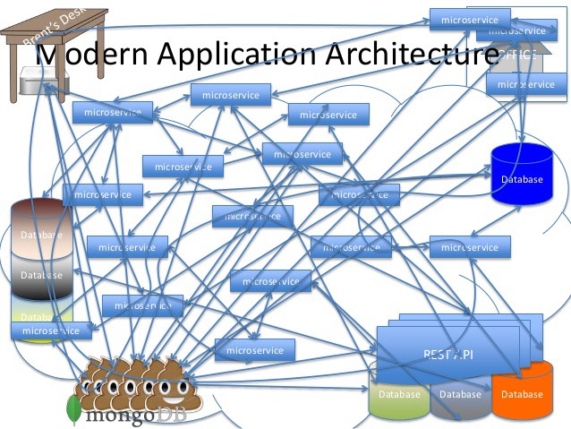
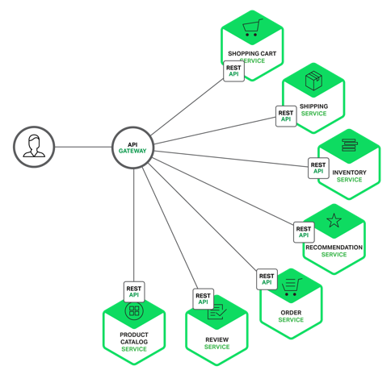
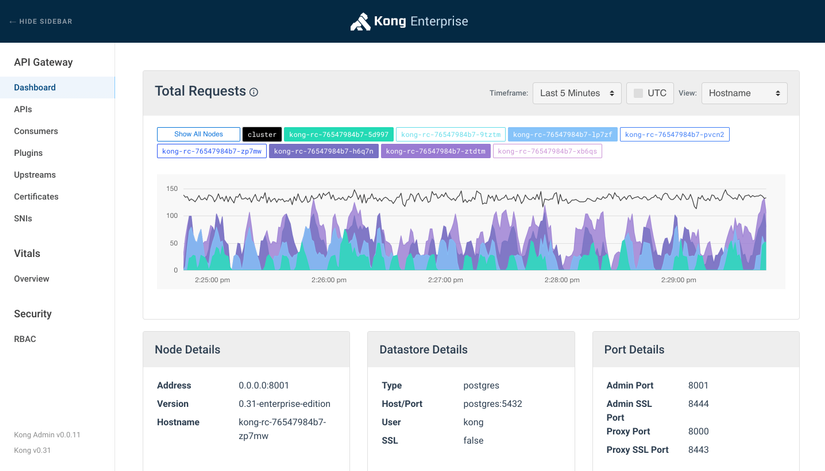
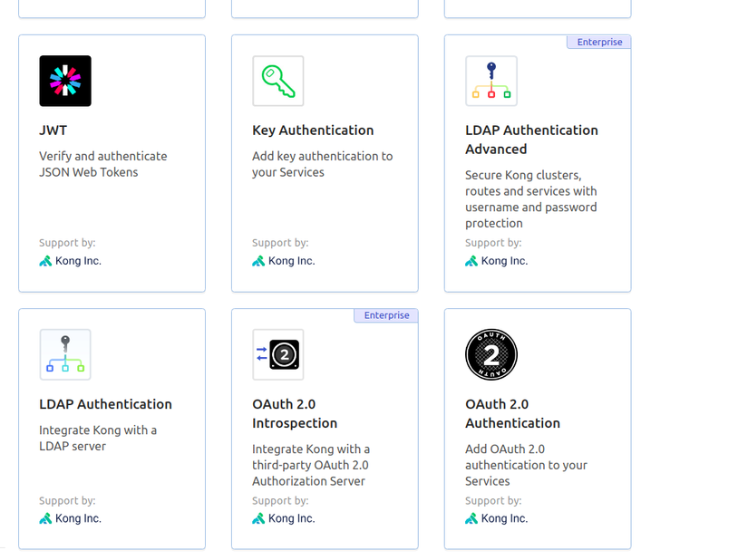

# Tìm hiều về Gateway API

## 1. Đặt vần đề
Một hệ thống microservices trung bình sẽ có một vài cho tới hàng trăm services khác nhau, nếu như client giao tiếp trực tiếp với các services này thì sơ đồ giao tiếp giữa client và hệ thống của chúng ta sẽ trông như một nồi cám lợn như này:

Chính vì cái nồi cám lợn trên cho nên mới xuất hiện một giải pháp đó chính là API Gateway (tạm dịch là cổng kết nối API) đóng vai trò là một cổng trung gian giữa client và hệ thống microservices đằng sau. Khi đó hệ thống của chúng ta sẽ trở thành như thế này:

## 2. Gateway API là gì?
API Gateway có thể coi là một cổng trung gian, nó là cổng vào duy nhất tới hệ thống microservices của chúng ta, api gateway sẽ nhận các requests từ phía client, chỉnh sửa, xác thực và điều hướng chúng đến các API cụ thể trên các services phía sau.

Ngoài nhiệm vụ chính là proxy request thì một hệ thống API Gateway thường sẽ đảm nhận luôn vài vai trò khác như bảo mật API, monitoring, analytics số lượng requests cũng như tình trạng hệ thống phía sau.

## 3. Ưu điểm của Gateway API
### 3.1. Che dấu được cấu trúc của hệ thống microservices với bên ngoài
Clients sẽ tương tác với hệ thống của chúng ta thông qua api gateway chứ không gọi trực tiếp tới một services cụ thể, các endpoints của các services sẽ chỉ được gọi nội bộ, tức là gọi giữa các services với nhau hoặc được gọi từ API gateway, người dùng sẽ gọi các api này thông qua các public endpoints từ API Gateway. Chính vì vậy cho nên phía client không cần và cũng không thể biết được các services phía backend được phân chia như thế nào, việc refactor code frontend cũng dễ dàng hơn đối với lập trình viên.

### 3.2. Phần code phía frontend sẽ gọn gàng hơn
Vì không phải tracking nhiều endpoints, tất cả chỉ việc gọi đến api gateway nên phần code frontend sẽ gọn gàng hơn so với việc phải tracking hàng tá endpoints trên từng services một, nhất là khi mà hệ thống ngày một phình to ra.

### 3.3. Dễ dàng theo dõi và quản lý traffic
Hầu hết các hệ thống API gateway phổ biến hiện nay đều sẽ đi kèm tính năng theo dõi và quản lý lượng traffic bằng GUI hoặc thông qua các APIs của hệ thống Gateway, VD như với Kong (bản EE)

### 3.4. Requests caching và cân bằng tải.
API Gateway sẽ kiêm luôn vai trò load balancer của hệ thống, requests sẽ không được gửi trực tiếp đến backend nên sẽ giảm thiểu được rủi ro hệ thống bị quá tải.

### 3.5. Thêm một lớp bảo mật nữa cho hệ thống.
API gateway giúp ngăn chặn các cuộc tấn công bằng cách thêm một lớp bảo vệ các loại tấn công như ddos, slq injections,...

### 3.6. Thay thế authentication services
API gateway thường cung cấp nhiều cơ chế xác thực, chúng ta có thể sử dụng nó để xác thực người dùng luôn, giúp tiết kiệm thời gian và làm hệ thống chúng ta đơn giản hơn. VD một vài cơ chế xác thực hỗ trợ bởi Kong API gateway

Và rất nhiều ưu điểm khác với tùy loại API Gateway

## 4. Nhược điểm của Gateway API
### 4.1. Tăng thời gian response
Vì phải đi qua server trung gian cho nên việc response sẽ bị trễ hơn so với việc gọi trực tiếp tới hệ thống.

### 4.2. Thêm tác nhân gây lỗi
Để sử dụng API Gateway thì chúng ta sẽ phải config, rồi chỉnh sửa code, quản lý server gateway, bla bla...Khiến cho chúng ta có thêm việc phải lo, chẳng may gateway có lỗi thì requests sẽ không thể tới được phía server.

### 4.3. Có thể gây nghẽn cổ chai
Nếu như không được scale hay config hợp lý thì gateway sẽ có thể bị quá tải và làm chậm hệ thống của chúng ta.

### 4.4. Tốn thêm tiền
Tiền server, tiền điện, tiền quản lý hệ thống api gateway, với hệ thống lớn cần các tính năng xịn sò thì còn tốn thêm tiền mua bản Enterpise của các api gateway nữa này, tính ra cũng không rẻ chút nào cả.

## 5. Tổng kết
Gateway API là một công cụ mạnh mẽ để thực hiện điều phối các service một các hiệu quả đồng thời giúp cho code trở nên tốt hơn. Nhưng vẫn có một số mặt hạn chế mà ta cần phải xử lý, ta có thể tóm lại như sau.

>***Khái niệm**: GatewayAPI là một cổng trung gian, sẽ nhận các requests từ phía client, chỉnh sửa, xác thực và điều hướng chúng đến các API cụ thể trên các services phía sau.*

| Ưu điểm                                                    | Nhược điểm                                                      |
| ---------------------------------------------------------- | --------------------------------------------------------------- |
| Che giấu được hệ thống của các microservices với bên ngoài | Tăng thời gian response                                         |
| Thêm một lớp bảo mật nữa cho hệ thống                      | Thêm các tác nhân gây lỗi                                       |
| Thay thế authentication services                           |                                                                 |
| Có chơ chế để theo dõi traffic                             | Tốn tiền đối với các hệ thống cần nhiều chức năng chuyên nghiệp |
| Requests caching và cân bằng tải.                          |                                                                 |
| Code front-end dễ dàng hơn                                 | Có thế gây nghẽn cổ chai                                        |
## 6. Một số GatewayAPI thường gặp
[Nginx](./Nginx.md)

