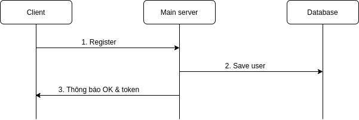
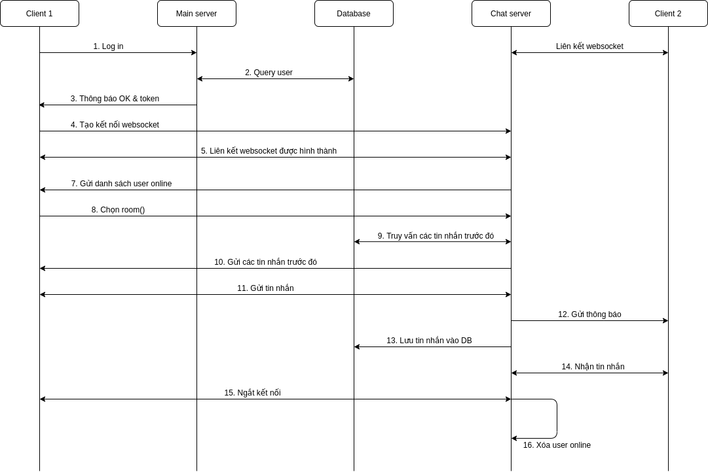

# API Design
## 1. Đăng kí
Khi app client thực hiện quá trình đăng kí, một yêu cầu sẽ được gửi lên trong đó có chứa thông tin về tài khoản mới. Nếu thành công, client sẽ nhận được một thông báo và token từ server.

Quá trình thực hiện được thể thiện qua Sequence diagram sau:


### 1.1 Register
- POST: /register
- Body: 
  - Username  string `json:"username"`
  - Passwords string `json:"passwords"`
  - Firstname string `json:"firstname"`
  - Lastname  string `json:"lastname"`

- Responses:

| Code | Decription               | Body                  |
| ---- | ------------------------ | --------------------- |
| 200  | Đăng kí thành công       | Register successfully |
| 401  | Đăng kí không thành công | nội dung của lỗi      |


### 1.2 Save user
- Main server thực hiện truy vấn khởi tạo thông tin người dùng
  
### 1.3 Thông báo OK & token
- Trả về thống báo thành công, nếu thất bại trả về lỗi
- [Response của phần 1.1](#11-register)

## 2. Thực hiện chat
Sau khi đăng kí thành công người dùng có thể thực hiện chat với những người hiện tại có trong hệ thống. Quá trình sẽ được mô tả như dưới đây:



Trong sơ đồ trên từ bước 1 đến 6 là quá trình đăng nhập, phần còn lại là quá trình thực hiện chat với một user online trong một cuộc hội thoại

### 2.1 Login
- POST: /login
- Body:
  - username
  - password

- Responses:

| Code | Decription                 | Body                                                                                                 |
| ---- | -------------------------- | ---------------------------------------------------------------------------------------------------- |
| 200  | Đăng nhập thành công       | JSON:{user.ID, user.Lastname, user.Firstname} client dùng thông tin này để giao tiếp với chat server |
| 401  | Đăng nhập không thành công | Invalid username or password                                                                         |

### 2.2 Query user
- Thực hiện truy vấn trong CSDL xem có tồn tại user trong hệ thống hoặc user đó có nhập đúng mật khẩu hay không: 
  > SELECT passwords FROM Users WHERE username = {?}

- Lấy về mật khẩu của username đó và thực hiện so sánh trong mainserver

### 2.3 Thông báo OK
- [Response của phần 2.1](#21-login)

### 2.4 Tạo kết nối websocket
- Websocket: /home/{user-id}/ws
- User sử dụng đường dẫn này để thông báo cho chatserver biết mình trạng thái của user
- Liên kết này truyền thông tin về user, state: dưới dạng json
    {
      "ID": int,
      "Firstname": string,
      "Lastname": string,
      "State":string
    }
### 2.5 Liên kết ws được hình thành
- Websocket: /ws
- Server sử dụng liên kết này để:
  - Hiển thị các client online nếu Client đang ở trong /home
  - Thông báo cho Client biết có tin nhắn chờ nếu client đang ở trong /ws
- Client dùng ws này để thông báo tình trạng của nó và dùng để gửi các tin nhắn đến server:
 

### 2.7 Gửi danh sách user online
- Websocket: /ws
- Kiểu dữ liệu sử dụng: json
- Thông tin gửi về với dạng 
```
    {
      {"ID": int,
      "Name": string,
      }, 
      {"ID": int,
      "Firstname": string,
      },
      ...
    }
```

### 2.8 Chọn room 
- Websocket: /ws
- Thông tin gửi lên: 
```
  {
    Event: initial-room,
    ID: int,
    Name: string,
    Context: string,
    Receiver: []int (User's ID in room)
  }
```
- Thông tin gửi về:
```
  {
    Event: has-message,
    ID: int,
    Name: string (Room name),
    Context: string,
    Receiver: []int (User's ID in room except sender)
  }
```
  
  > Thông tin phòng bao gồm
```
    {
      "room-id": int,
      "users-id": string,
    }
```

- Websocket: /ws
- Đây là liên kết được sử dụng để chat trong phòng
- Trong trường hợp 2 user chưa từng nói chuyện với nhau thì cần tạo phòng

### 2.9 Truy vấn các tin nhắn trước đó
- GET: /chat/{room-id}
  > SELECT * FROM {message-table-name} 
- Tin thông tin truy vấn được trả vê cho Chat server dưới dạng:
  > id INT(6) UNSIGNED AUTO_INCREMENT PRIMARY KEY \
sender VARCHAR(20) NOT NULL unique key \
content VARCHAR(100) NOT NULL \
roomID INT(6) UNSIGNED 


### 2.10 Gửi các tin nhắn về cho user
- Gửi các tin nhắn về trước theo liên kết websocket
- Thực hiện gửi về client mảng tin nhắn dưới dạng json (có giới hạn số lượng tin nhắn) 
```
    {
      {
        "Event": "message"
        "ID":int,
        "Name": string,
        "Context":string,
        "Receiver": string
      },
      {
        "Event": "message"
        "ID":int,
        "Name": string,
        "Context":string,
        "Receiver": string
      },
      ...
    }

```
### 2.11 Gửi tin nhắn
- Websocket: /ws
- Client gửi tin nhắn lên websocket 

### 2.12 Gửi thông báo
- Websocket: /ws
- Server gửi thông báo xuống Client 2 thông qua ws trên, thông báo có dạng json như sau:
```
    {
      "Event": "has-message"
      "ID":int,
      "Name": string,
      "Context": "Room's-Users-ID",
      "Receiver": string
    }
```

### 2.13 Lưu tin nhắn vào Database

    insert into Message (RoomID,SenderID,MsgContent) value ( ?, ?, ?)

### 2.14 Nhận tin nhắn
- var clients = make(map[*websocket.Conn]bool)
- Gửi tin nhắn về tất cả các client trong phòng thông qua mảng lưu trữ các kết nối của client đến server

### 2.15 Ngắt kết nối
- Client thực hiện ngắt kết nối (đóng trình duyệt, đăng xuất, lỗi,...)

### 2.16 Xóa user online
- Thực hiện xóa user online trong Chat Client để thông báo với người dùng khác
