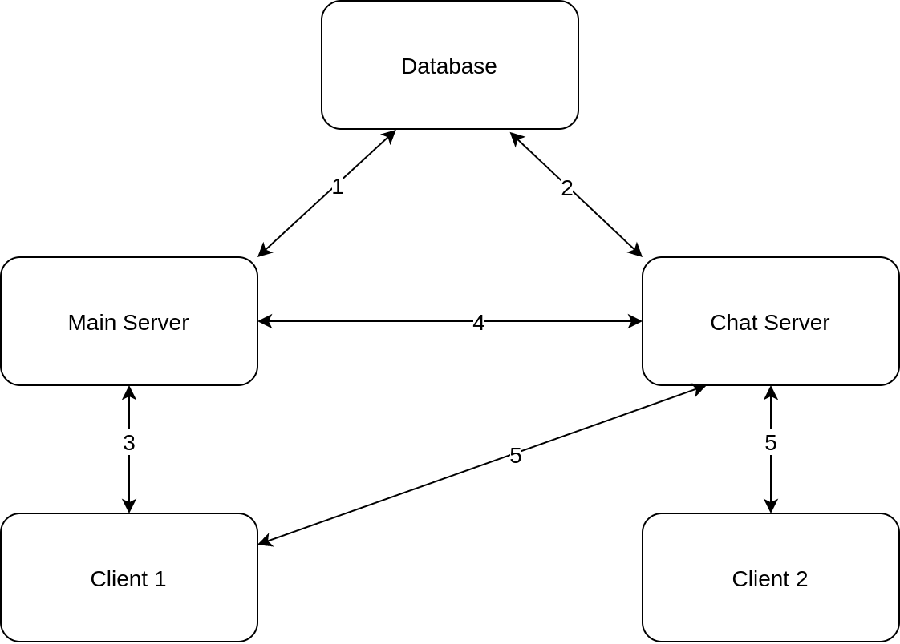

# Hệ thống nhắn tin sử dụng websocket và restfulAPI
## Yêu cầu hệ thống
- Ứng dụng chat viết bằng Golang/nodejs/java/python gồm client + server
- Sử dụng websocket và restful
- Tính năng:
  - Đăng ký người dùng với user name + password
  - Chat giữa 2 người dùng biết user name của nhau
  - Chat nhóm giữa nhiều người biết user name của nhau

## Kiến trúc hệ thống đề xuất
Từ các yêu cầu trên, hệ thống được đề xuất:

Trong các phần chi tiết trong thiết kế sẽ được trình bày ở:
- [Thiết kế kiến trúc](Architecture.md)
- [Thiết kế database](Database.md)
- [Thiết kế API](API_design.md)
